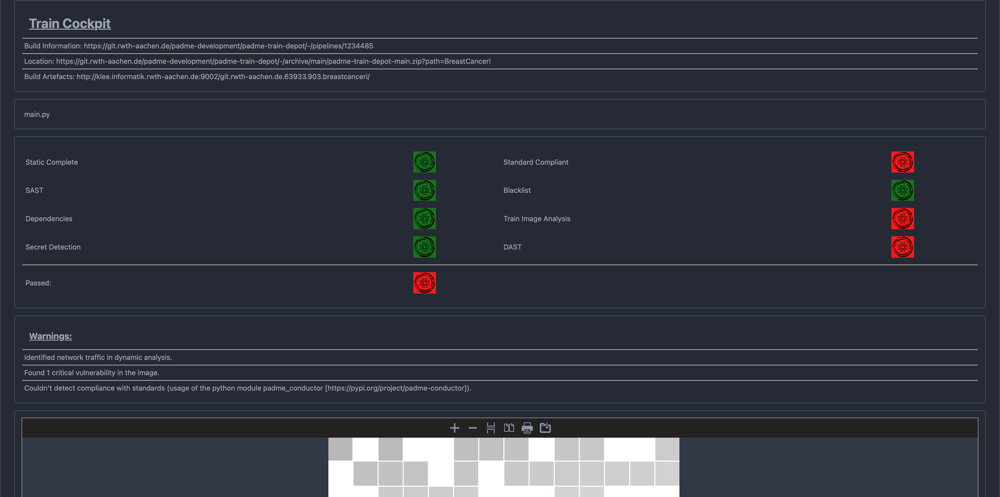
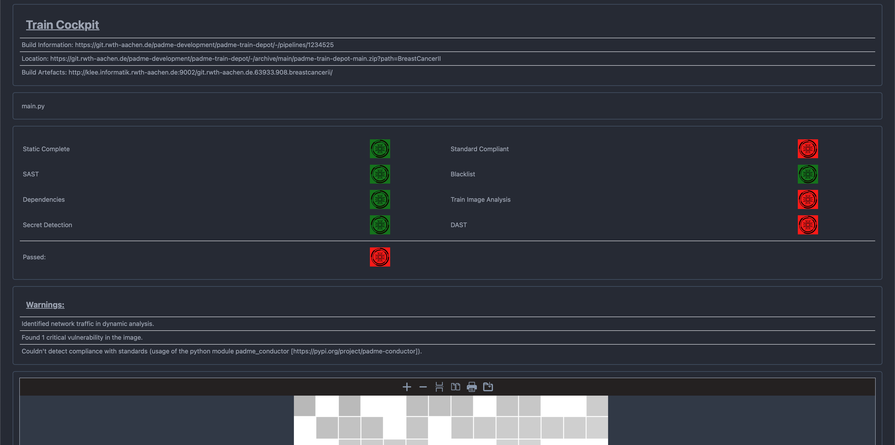
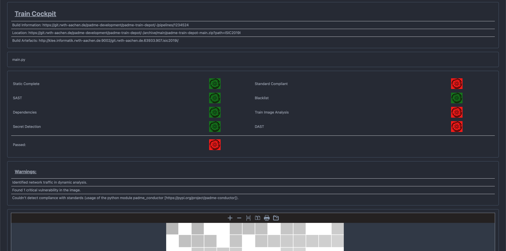
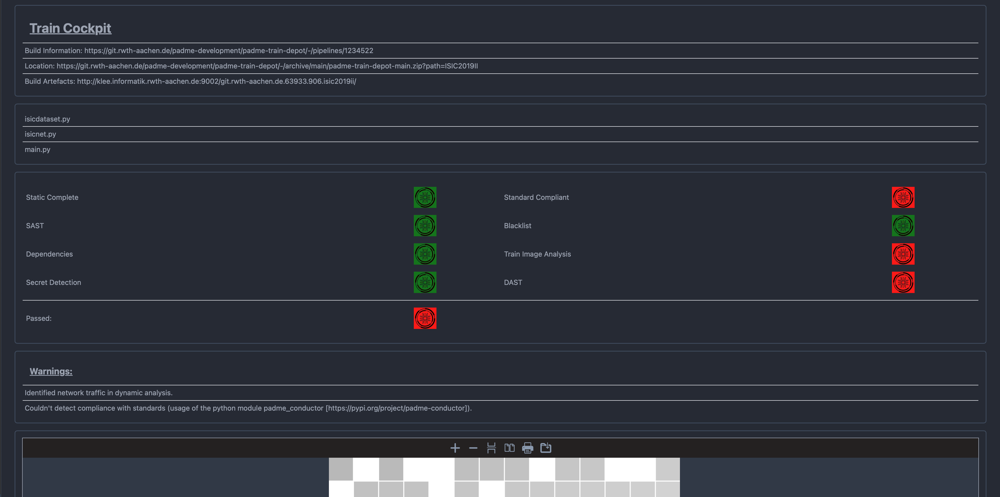
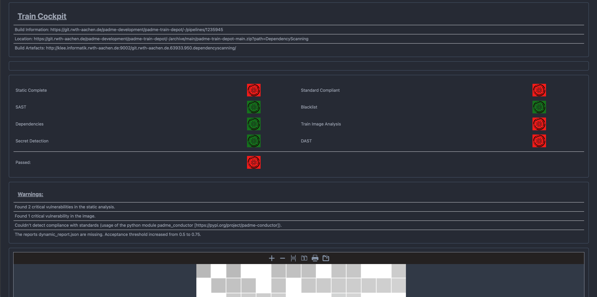
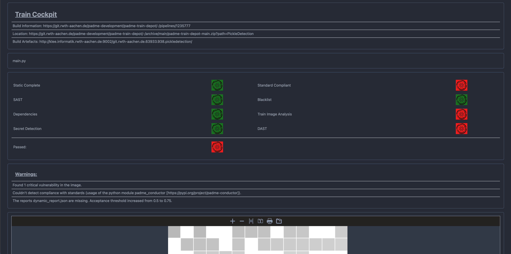
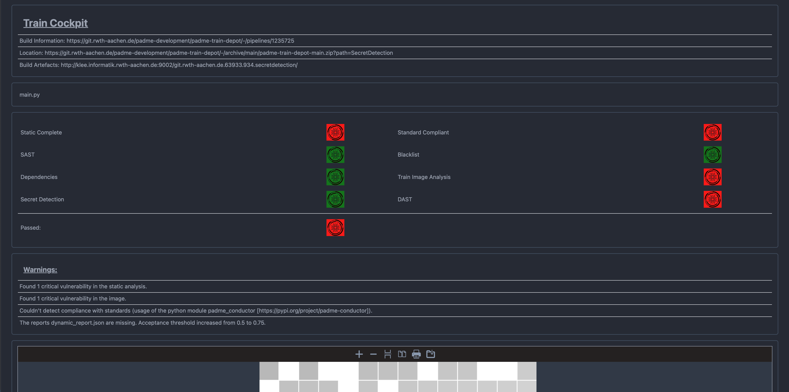
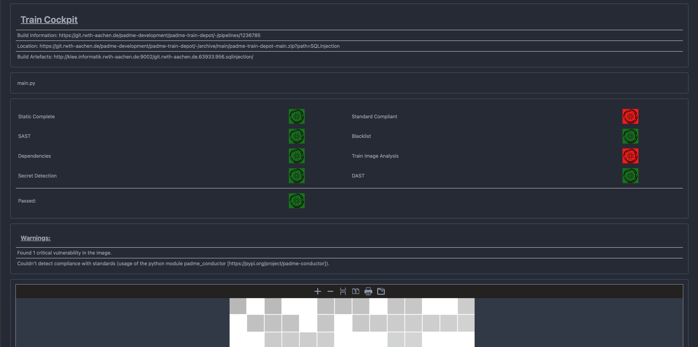

## Example Trains
Here we provide the trains that we used in the evaluation of our securit audit pipeline as well as some examples of trains performing analyses on real data.

Within every directory you can find the Dockerfile for creating the container train, as well as a python script containing the code that will be executed inside the train.
Further you can find the full pdf report generated by the audit pipeline together with a screenshot of the _Trainwiki_ frontend.

Train | PDF Report | Online Report | Link 
--- | --- | --- | --- 
Breast Cancer I |  | [Download](BreastCancerI/report.pdf) | [To Files](BreastCancerI)
Breast Cancer II|  | [Download](BreastCancerII/report.pdf) | [To Files](BreastCancerII)
ISIC 2019 I |  | [Download](ISIC2019I/report.pdf) | [To Files](ISIC2019I)
ISIC 2019 II |  | [Download](ISIC2019II/report.pdf) | [To Files](ISIC2019II)
Dependency Scanning |  | [Download](DependencyScanning/report.pdf) | [To Files](DependencyScanning)
Image Analysis |  | [Download](ImageAnalysis/report.pdf) | [To Files](ImageAnalysis)
Pickle Detection |  | [Download](PickleDetection/report.pdf) | [To Files](PickleDetection)
Secret Detection |  | [Download](SecretDetection/report.pdf) | [To Files](SecretDetection)
SQL Injection |  | [Download](SQLInjection/report.pdf) | [To Files](SQLInjection)